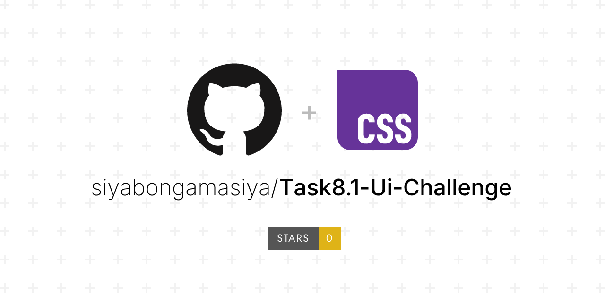

# Loopstudios Landing Page (React + CSS)

This is my version of the **Loopstudios Landing Page**, rebuilt using **React** and **custom CSS**.  
The project demonstrates my ability to create responsive, modern UI layouts while keeping clean and reusable code.  

## Project Structure

public/
src/
│
├── assets/ # Images, icons, and static assets
│
├── components/ # Reusable React components
│ ├── creations.tsx # Section showcasing featured creations
│ ├── customHooks.tsx # Custom hooks for state or logic handling
│ ├── footer.tsx # Footer with social icons and copyright
│ ├── header.tsx # Header with hero section
│ ├── imagesSeaction.tsx # VR image and description section
│ ├── logoNavBar.tsx # Logo and navigation bar
│ └── nav.tsx # Navigation component
│
├── design/ # Styles, themes, or design utilities
│
├── pages/ # Page-level components (if routing is used)
│
└── main.tsx # Entry point for rendering the app


## Features

- Fully **responsive landing page**  
- Built with **React functional components**  
- **CSS variables** for theme consistency  
- **Google Fonts** integration (`Alata` and `Josefin Sans`)  
- Uses **Flexbox** and **CSS Grid** for layouts  
- Media queries for mobile and tablet responsiveness  


## Sections Overview

1. **Header**
   - Logo and navigation bar  
   - Hero background with large styled heading  

2. **Image Section**
   - Showcases VR image and description text  

3. **Creations**
   - Grid layout for desktop (4 columns)  
   - Stacked layout for mobile view  
   - "See All" button included  

4. **Footer**
   - Social media icons  
   - Copyright  


## Styling

- Custom **CSS variables** for colors and fonts  
- **Media queries** for different screen sizes  
- Adjusted font sizes, margins, and layouts for mobile  


## Installation & Setup

1. Clone the repository:
   ```bash
   git clone https://github.com/siyabongamasiya/Task8.1-Ui-Challenge.git

2. Navigate into the folder:

   cd Task8.1-Ui-Challenge

3. Install dependencies:

   npm install

4. Start the development server:

   npm run dev

## Responsiveness

Desktop → Hero image with text, grid for creations

Tablet/Mobile → Stacked layout, larger fonts, centered content